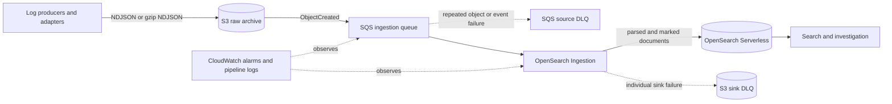

# AWS Log Platform (2026)

[](https://github.com/sudoworks-lab/aws-log-platform/actions/workflows/terraform-ci.yml)

AWS Log Platform is a Terraform-based reference implementation for durable log evidence and rebuildable search. Producers write NDJSON to Amazon S3 first; S3 notifications travel through Amazon SQS; Amazon OpenSearch Ingestion (OSIS) parses and enriches records; and Amazon OpenSearch Serverless (AOSS) serves a private, time-bounded search projection. Terraform owns the environment boundaries, strict `logs` index mapping, IAM rules, lifecycle settings, and operational signals. The core data path and failure path were validated in a temporary development deployment in `ap-northeast-1`; the deployment and its test resources were destroyed afterward. This repository does not provide a continuously running environment or automatic deployment, and any deployment requires explicit account, security, quota, cost, and runtime review.

## Problem

Durable evidence and search availability are different operational concerns. If a canonical S3 object is lost, the platform has a raw-data incident. If an index is unavailable, ingestion is delayed, or a search projection is deleted, the platform has a search incident that can be recovered by rebuilding from retained S3 objects. The design makes that distinction visible in storage, permissions, failure handling, and recovery procedures.

## Key decisions

- S3 is the canonical raw archive. OpenSearch is a rebuildable projection and never the only copy of a log.
- SQS is the durable object/event retry boundary. Its source DLQ contains failed object/event messages, not individual sink documents.
- OSIS owns managed ingestion runtime behavior: polling, visibility extension, decompression, parsing, retries, and sink-DLQ delivery.
- Terraform owns the exact `logs` index and its strict mapping. OSIS uses `management_disabled`; unknown fields remain in `_source` but do not become searchable without schema review.
- AOSS is private-only in steady state. A default-off, exact-collection network exception exists only for the measured AWS Cloud Control index lifecycle constraint and is removed by the lifecycle helper after the operation.

## Validated on AWS

The runtime evidence covers a dev-only temporary deployment. No production environment was deployed, and all test resources and test data were removed after validation.

- OSIS reached `ACTIVE` and processed the S3 → SQS → OSIS → private AOSS path.
- A private SigV4 query returned indexed documents with the occurrence timestamp, `ingested_at`, and expected parsed fields.
- Malformed JSON was preserved as the raw `message` with an explicit parse-status marker.
- Terraform-managed strict mapping was observed at runtime: `http.status_code` was `integer` with `coerce=false`, and `http.duration_ms` was `long` with `coerce=false`.
- A numeric-looking string was rejected by the strict mapping and preserved in the S3 sink DLQ; the source queue and source DLQ remained empty.
- Terraform destroy completed, including index and network-policy cleanup, and direct residual inventory was zero.

The exact evidence boundary and unverified production concerns are documented in [runtime validation](docs/runtime-validation.md).

## What I learned and evolved from the 2022 implementation

The earlier design used Fluentd, multiple Firehose delivery streams, Lambda for transport or notification gaps, OpenSearch, selected S3 output, and CloudWatch-to-Slack alerting. It was useful for learning batching, retries, formats, permissions, and operational failure modes. This version turns those lessons into explicit ownership boundaries: S3 before search, separate source and sink failure units, event time distinct from ingestion time, Terraform-owned schema, separate dev/prod state roots, and least-privilege policies that can be reviewed independently.

See the detailed comparison in [migration from 2022](docs/migration-from-2022.md).

## Architecture



The implemented boundary starts when an object exists under the configured S3 raw prefix. Fluent Bit, OpenTelemetry Collector, CloudWatch Logs, and Amazon Data Firehose are representative producer adapters, but none is provisioned here. Producers must preserve the S3 object and event schema contracts.

The two DLQs have different scopes:

- The SQS source DLQ contains S3 object-event messages that repeatedly failed source processing. One message can represent an entire object that is not yet searchable.
- The S3 sink DLQ contains individual documents that OSIS could not write to AOSS after sink handling. Failure to write those records to the S3 sink DLQ is a high-severity ingestion incident, although the original raw object remains canonical in S3.

The source does not rely only on a fixed SQS visibility timeout. While long-running object processing remains in flight, visibility duplication protection extends visibility up to the configured limit to reduce duplicate consumers; the standard queue remains at-least-once.

## Event contract

Each NDJSON line must be a JSON object with `timestamp` in ISO-8601 form with milliseconds and a timezone, for example `2026-09-03T10:15:30.123Z`. `timestamp` and the derived `@timestamp` both mean event occurrence time. `ingested_at` means the time the source received the event for processing; it must not replace occurrence time.

On a successful JSON parse, the indexed `message` is the application's message from the JSON object. On malformed JSON, processing continues, `message` retains the raw line, and `log_platform.parse_status` marks the document as `malformed_json`. Successfully parsed events do not receive that failure marker. A malformed event does not receive a fabricated occurrence timestamp.

The Terraform-managed `logs` index uses `dynamic: false` and explicitly maps the supported root fields and the `http`, `error`, and `log_platform` objects. Unknown fields remain available in `_source`, but are not searchable until schema review adds an explicit mapping. Numeric fields must be encoded as JSON numbers; numeric-looking strings violate the schema and rejected documents are isolated in the S3 sink DLQ. See [architecture.md](docs/architecture.md) for the field list.

## Data lifecycle and capacity

S3 objects remain canonical and are never deleted by the ingestion pipeline. Configurable lifecycle settings move current and noncurrent objects from S3 Standard to Standard-IA and then Deep Archive. Expiration is disabled by default and can only be enabled deliberately.

`search_retention_days` controls the AOSS time-series data lifecycle period for the rebuildable search projection. It does not select or control hot/warm placement.

The OSIS persistent buffer is not adopted in this design because S3 plus SQS form the explicit durability boundary. This does not reject persistent buffering as a capability: enabling it later requires an explicit OCU allocation, KMS ownership and permissions, and cost design, and it would not replace the canonical archive or replay queue.

Production uses a minimum of 2 ingestion OCUs, which distributes active ingestion OCUs across 2 Availability Zones. Development uses a minimum of 1 OCU to reduce cost and accepts the corresponding availability tradeoff. Minimum and maximum OCU settings must be tuned against measured throughput, cost, and the search-freshness SLO.

## Failure model

The A–H failure model separates canonical raw loss from search unavailability and distinguishes source-message failures from individual sink-document failures. See [operations.md](docs/operations.md) for the complete runbooks.

## Terraform structure

`infra/modules` contains modules aligned to lifecycle, ownership, reuse, and security boundaries. `infra/live/dev` and `infra/live/prod` are independent root configurations with independent S3 backend keys. The small amount of root wiring is intentionally repeated so production state does not share a root or workspace blast radius with development.

Terraform workspaces remain useful for light variations of the same environment. They are not the primary isolation boundary here: environments with materially different accounts, permissions, lifecycle, or blast radius get separate root configurations and state objects.

Remote state uses a partial `backend "s3" {}` configuration. Each `backend.hcl.example` enables encryption and native S3 lockfiles with `use_lockfile = true`; deprecated DynamoDB-based locking is not copied forward. Backend buckets are intentionally not created or named by this repository.

The AWS Cloud Control index resource cannot complete its lifecycle against this collection while every matching AOSS network policy is private. Index apply/update operations must therefore use `scripts/aoss-index-lifecycle.sh apply --root infra/live/<environment> -- <terraform-options>`: it first applies an exact-collection, collection-only network exception, then removes it in a second successful apply. The helper's `destroy` mode enables the same exception before destroy and keeps it enabled until the index and policy are deleted. The helper requires an explicit live root, preserves the root's existing backend initialization, accepts options such as `-var-file=terraform.tfvars`, and never chooses production by default. See [operations.md](docs/operations.md) before a deployment review.

## Security

- S3 blocks public access, enforces bucket-owner object ownership, enables versioning and default encryption, and denies insecure transport.
- SQS and its source DLQ use SQS-managed encryption and exact queue/bucket conditions for S3 event delivery.
- AOSS uses mandatory encryption, a private AOSS-managed VPC endpoint, an explicit network policy, and separate writer and reader data rules.
- Private-only is the required steady state. The default-off provisioning exception temporarily makes only the exact collection network-reachable for AWSCC index lifecycle operations; it never exposes Dashboards or changes data authorization.
- The ingestion role can read only the configured archive prefix and consume only the configured queue. Sink-DLQ writes must be limited to the designated S3 bucket and prefix.
- `reader_principals` accepts collection-account IAM role/user ARNs and AOSS SAML user/group identity strings. Cross-account users must assume a role in the collection account. The SAML provider remains owned by the external identity platform.
- Terraform owns the exact `logs` index lifecycle. The ingestion data policy grants OSIS the documented create, update, describe, and document-write actions only on that index, but `management_disabled` prevents the pipeline configuration from managing its schema. OSIS receives no template, read, or delete permissions.
- No credentials or secrets appear in Terraform or the example configuration. Deployment-specific identifiers are supplied outside the repository.

See [security.md](docs/security.md) for IAM and data-access details.

## Five-minute review path

1. Read this summary and the [architecture diagram and contracts](docs/architecture.md).
2. Read [runtime validation](docs/runtime-validation.md) to see what was proven on AWS and what remains unverified.
3. Inspect the module boundaries under `infra/modules`, the independent roots under `infra/live`, and the mock tests under each module's `tests/` directory.
4. Review [security](docs/security.md) and [operations](docs/operations.md) for IAM, private networking, lifecycle handling, and failure recovery.
5. Compare the design with the [2022 migration](docs/migration-from-2022.md), or read the [Japanese case study](docs/portfolio-ja.md) for the portfolio narrative.

## How to verify

Prerequisite: Terraform 1.10 or later. Run:

```bash
make verify
```

The script runs `terraform fmt -recursive -check`, then copies Terraform sources to a temporary directory and runs `terraform init -backend=false` and `terraform validate` for every module and live root. It also runs every module's `tests/*.tftest.hcl` with mocked providers and creates no AWS resources. It does not run a standalone `plan`, `apply`, or AWS API operation. If `tflint` is available, the script reports it but does not run it because no repository-specific plugin policy is defined.

Local validation proves syntax, provider schema compatibility, and module wiring only. It does not prove regional service availability, IAM effectiveness, service quotas, OSIS pipeline acceptance, data throughput, availability behavior, or runtime recovery.

## Scope and operational boundary

This repository provides Terraform configuration, tests, lifecycle procedures, and evidence documentation. It does not provide a continuously running AWS environment, automatic deployment, producer adapters, a dashboard frontend, an authentication UI, a SAML provider, multi-Region operation, cross-account central logging, a SIEM, Amazon Security Lake, a full OpenTelemetry traces/metrics platform, incident automation, Kubernetes, or Slack integration.

## Start here

1. Read [architecture.md](docs/architecture.md) and [security.md](docs/security.md).
2. Copy the examples in one `infra/live/<environment>` directory without putting credentials in them.
3. Run `make verify`.
4. Treat any plan or deployment as a separate change requiring an AWS account review, quota check, cost review, and runtime test plan.

## Documentation

- [Japanese portfolio case study](docs/portfolio-ja.md)
- [Runtime validation report](docs/runtime-validation.md)
- [Architecture](docs/architecture.md)
- [Security](docs/security.md)
- [Operations and failure handling](docs/operations.md)
- [Migration from 2022](docs/migration-from-2022.md)

## Authoritative references

- [AWS: S3 as an OpenSearch Ingestion source](https://docs.aws.amazon.com/opensearch-service/latest/developerguide/configure-client-s3.html)
- [AWS: OpenSearch Ingestion pipeline features and S3 sink DLQs](https://docs.aws.amazon.com/opensearch-service/latest/developerguide/osis-features-overview.html)
- [AWS: scaling OpenSearch Ingestion pipelines](https://docs.aws.amazon.com/opensearch-service/latest/developerguide/ingestion-scaling.html)
- [AWS: OpenSearch Serverless data access](https://docs.aws.amazon.com/opensearch-service/latest/developerguide/serverless-data-access.html)
- [AWS: SAML authentication for OpenSearch Serverless](https://docs.aws.amazon.com/opensearch-service/latest/developerguide/serverless-saml.html)
- [AWS: OpenSearch Ingestion metrics](https://docs.aws.amazon.com/opensearch-service/latest/developerguide/monitoring-pipeline-metrics.html)
- [HashiCorp: S3 backend and native lockfiles](https://developer.hashicorp.com/terraform/language/backend/s3)

## License

This project is licensed under the [MIT License](LICENSE).
