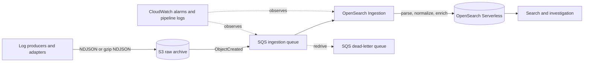

# AWS Log Platform Reference Architecture (2026)

This repository shows how I would design an AWS log search platform in 2026: raw logs land in Amazon S3 first, S3 events are buffered by Amazon SQS, Amazon OpenSearch Ingestion parses and enriches the records, and Amazon OpenSearch Serverless provides a replaceable hot search tier. It is a reference architecture only; it does not deploy anything by itself and this repository forbids `terraform apply` unless that restriction is explicitly changed later.

## Why

The central decision is to separate durable evidence from a searchable projection. Amazon S3 is the durable source of truth and long-term archive. OpenSearch contains a time-bounded, rebuildable view optimized for investigation. Losing an index is therefore a search availability incident, while losing the archive is a data-loss incident with a much higher severity.

Managed ingestion is chosen for a specific responsibility split, not merely because it is managed. AWS owns scaling, retry machinery, buffering, patching, and ingestion runtime operation. Platform owners still own the log schema, archive and index lifecycle, access policy, monitoring, replay procedure, and failure handling.

## Architecture



The implemented boundary starts when an object exists under the configured S3 raw prefix. Fluent Bit, OpenTelemetry Collector, CloudWatch Logs, and Amazon Data Firehose are representative producer adapters, but none is provisioned here. Teams should select only the adapter that matches their workload and preserve the S3 object contract.

## Data lifecycle

S3 objects remain canonical and are never deleted by the ingestion pipeline. Configurable lifecycle variables move current and noncurrent objects from S3 Standard to Standard-IA and then Deep Archive. Expiration is disabled by default and can only be enabled deliberately.

OpenSearch Serverless uses a time-series collection and a configurable data lifecycle retention period. It is a hot projection, not a backup. Rebuilding it means replaying retained S3 objects into an ingestion queue after controlling duplicate delivery and capacity.

## Failure model

SQS absorbs bursts and makes consumer outages visible. Visibility timeout and retry isolate temporary failures; messages that repeatedly fail move to a DLQ for inspection and controlled redrive. A malformed line can fail JSON parsing while its original S3 object remains intact. An unavailable pipeline or search collection delays searchability but does not remove the raw log.

The operational distinction is intentional:

- **Search unavailable:** investigate queue age, DLQ depth, pipeline logs and metrics, and OpenSearch access/capacity. Restore or rebuild the projection from S3.
- **Raw log unavailable:** treat as a data-loss or archive-access incident. Restore an archived object/version before attempting replay.

See [operations.md](docs/operations.md) for the scenario runbooks.

## Terraform structure

`infra/modules` contains modules aligned to lifecycle, ownership, reuse, and security boundaries. `infra/live/dev` and `infra/live/prod` are independent root configurations with independent S3 backend keys. The small amount of root wiring is intentionally repeated so that production state does not share a root or workspace blast radius with development.

Terraform workspaces remain useful for light variations of the same environment. They are not the primary isolation boundary here: environments with materially different accounts, permissions, lifecycle, or blast radius get separate root configurations and state objects.

Remote state uses a partial `backend "s3" {}` configuration. Each `backend.hcl.example` enables encryption and native S3 lockfiles with `use_lockfile = true`; deprecated DynamoDB-based locking is not copied forward. Backend buckets are intentionally not created or named by this repository.

## Security

- S3 blocks public access, enforces bucket-owner object ownership, enables versioning and default encryption, and denies insecure transport.
- SQS and its DLQ use SQS-managed encryption and exact queue/bucket conditions for S3 event delivery.
- OpenSearch Serverless uses mandatory encryption, a private OpenSearch Serverless-managed VPC endpoint, an explicit network policy, and separate least-privilege data rules for ingestion and readers.
- The ingestion role can read only the configured archive prefix and consume only the configured queue.
- No credentials or secrets appear in Terraform. Account IDs, principal ARNs, VPC IDs, and subnet IDs are deployment inputs, not secrets.

Two narrowly explained `Resource = "*"` statements remain in the ingestion role: OpenSearch Serverless security-policy control-plane APIs constrained by the `aoss:collection` condition, and the isolated `s3:ListAllMyBuckets` action required for source bucket ownership validation. Neither AWS API supports resource-level scoping. See [security.md](docs/security.md).

## How to verify

Prerequisite: Terraform 1.10 or later. Run:

```bash
make verify
```

The script runs `terraform fmt -recursive -check`, then copies Terraform sources to a temporary directory and runs `terraform init -backend=false` and `terraform validate` for every module and live root. It also runs the ingestion module's `terraform test`, whose provider is mocked and which creates no AWS resources. It does not run a standalone `plan`, `apply`, or any AWS API operation. If `tflint` is available it is reported, but its absence does not fail verification.

Local validation proves syntax, provider schema compatibility, and module wiring only. It does not prove regional service availability, IAM effectiveness, service quota, pipeline semantic acceptance by the OSIS API, data throughput, or runtime recovery.

## What is intentionally NOT implemented

This repository does not implement an AWS deployment, an application, producer adapters, a dashboard frontend, an authentication UI, multi-Region operation, cross-account central logging, a SIEM, Amazon Security Lake, a full OpenTelemetry traces/metrics platform, production incident automation, Kubernetes, or Slack integration.

## Start here

1. Read [architecture.md](docs/architecture.md) and [security.md](docs/security.md).
2. Copy the examples in one `infra/live/<environment>` directory without putting credentials in them.
3. Run `make verify`.
4. Treat any future plan or deployment as a separate, explicitly authorized task with an AWS account review, quota check, cost review, and runtime test plan.

## Authoritative references

- [AWS: S3 as an OpenSearch Ingestion source](https://docs.aws.amazon.com/opensearch-service/latest/developerguide/configure-client-s3.html)
- [AWS: granting OpenSearch Ingestion access to Serverless collections](https://docs.aws.amazon.com/opensearch-service/latest/developerguide/pipeline-collection-access.html)
- [AWS: OpenSearch Serverless security](https://docs.aws.amazon.com/opensearch-service/latest/developerguide/serverless-security.html)
- [AWS: OpenSearch Ingestion metrics](https://docs.aws.amazon.com/opensearch-service/latest/developerguide/monitoring-pipeline-metrics.html)
- [HashiCorp: S3 backend and native lockfiles](https://developer.hashicorp.com/terraform/language/backend/s3)
