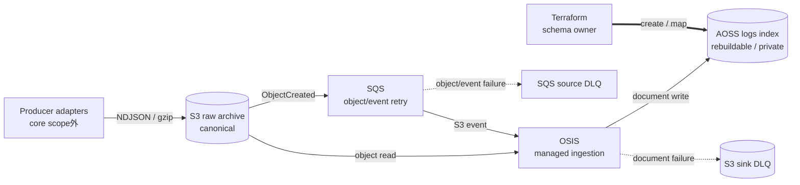

# AWS Log Platform

[](https://github.com/sudoworks-lab/aws-log-platform/actions/workflows/terraform-ci.yml) · [MIT License](LICENSE)

**raw logの保全と検索の可用性を分ける、Terraform製のAWSログ基盤リファレンス実装。**
S3へ先に原本を保存し、SQS → OpenSearch Ingestion（OSIS）→ OpenSearch Serverless（AOSS）で検索可能にする。検索が止まった場合の復旧元を、検索系の外に残す。

- **正本と再構築**: S3がcanonical raw archive、AOSSが保持期間を持つ再構築可能なsearch projection
- **責務と失敗単位**: SQSがobject/eventのretry境界、OSISがingestion runtime、Terraformがexact `logs` indexとschemaを所有
- **分離とアクセス**: dev/prodは別root・別state。AOSSの定常状態はprivate-only
- **現在地**: temporary dev環境で実AWSのdata pathとsink rejection / DLQを確認済み。検証環境は撤去済み。**production-readyは主張しない**

[実AWSの検証記録](docs/runtime-validation.md) · [ローカル検証](#クイックスタート--ローカル検証) · [詳細docs](#ドキュメント)

## Architecture — データ・所有権・失敗単位



実線はdata path、破線はfailure path、太線はschemaの管理経路。図はprivate-onlyの定常状態を示す。検索・DashboardsはAOSS-managed VPC endpoint経由、OSISはservice-managed PrivateLink経由でcollectionへ接続する。

coreの入力境界は、producerがS3 raw prefixへ完全なobjectを書き終えた時点。Fluent Bit、OpenTelemetry Collector、CloudWatch Logs、Firehoseなどのadapterは外部integrationとして扱う。

## 主な機能と設計判断

| 機能・境界 | なぜこの設計か |
| --- | --- |
| **S3へ先に保存** | ingestionは原本を削除しない。検索indexを失っても、保持済みobjectを復旧元にできる |
| **SQSでobject/eventを再試行** | source処理の失敗を可視化し、backlog・visibility・redriveを一つの境界で扱う |
| **OSISにruntimeを委ねる** | polling、visibility延長、展開、parse、sink retryをmanaged serviceへ集約する |
| **Terraformがschemaを所有** | exact `logs` indexをOSISより先に作る。`management_disabled`でruntimeとschema lifecycleを分離する |
| **rawとsearchの保持期間を分離** | S3のexpirationはdefault off。AOSSの`search_retention_days`は検索用の保持期間だけを制御する |
| **CloudWatchで失敗を観測** | queue age、source failure、sink rejection、sink DLQ write failureを区別する。通知先のintegrationは外部所有 |

OSIS persistent bufferは採用していない。S3とSQSをdurability境界とし、追加bufferのOCU・KMS・cost設計は別の判断として残す。AOSSのretention設定はhot/warm配置を制御しない。

## ログとschemaの契約

入力は1行1 JSON objectのNDJSON、またはgzip NDJSON。正常なeventには`message`と、millisecond精度・timezone付きISO-8601の`timestamp`が必要になる。

| 入力・処理 | 契約 |
| --- | --- |
| 発生時刻と受信時刻 | `timestamp` / `@timestamp`は発生時刻、`ingested_at`はsource受信時刻。欠落した発生時刻を処理時刻で埋めない |
| Malformed JSON | raw lineを`message`へ保持し、`log_platform.parse_status = malformed_json`を付けて処理を継続する |
| 未知のfield | `dynamic=false`。`_source`へ残すがindexしない。検索対象への追加には明示的なschema変更が必要 |
| Numeric field | `http.status_code`は`integer`、`http.duration_ms`は`long`。ともに`coerce=false`で、数値に見える文字列も拒否する |

field一覧と入力条件は[Architecture](docs/architecture.md#event-and-timestamp-contract)を参照する。

## 障害時に何が残るか

**SQS source DLQはobject/event、S3 sink DLQは個別document。** 同じ「DLQ」でも、影響範囲と再投入単位が異なる。

| 障害 | 残るもの・失敗単位 | 復旧の起点 |
| --- | --- | --- |
| S3通知・source処理の失敗、OSIS停止 | rawはS3。繰り返すobject/event処理の失敗はSQS source DLQ | 通知・権限・形式を修正し、対象objectを限定してreplay / redrive |
| AOSS sinkがdocumentを拒否 | rawはS3。個別の拒否documentと失敗情報はS3 sink DLQ | schema・権限を修正し、対象documentまたはobjectを再投入 |
| **sink DLQへの保存も失敗** | rawはS3に残るが、検索結果と直近の個別failure recordを失う | 高severityで扱い、原本とpipeline evidenceから対象を特定 |
| AOSS停止・index削除 | rawはS3。検索が停止・欠落 | index/schemaを復元し、S3 key・期間を限定して再構築 |
| Deep Archiveからのreplay | 保持済み原本はあるが、すぐには読めない | S3 restore後に再投入。restore時間とcostを考慮 |
| **canonical objectと全保持versionの喪失** | raw evidenceの損失 | producer側の回復可能性を調査。AOSSやsink DLQを原本の代わりにしない |

sink拒否documentはS3 sink DLQへの保存後にacknowledgeできるため、1件の不正documentだけを理由にobject全体を永久再処理しない。実AWSでもsink rejection時にsource queue / source DLQが空のままであることを観測した。source DLQのredrive成功を示す結果ではない。

S3通知とSQS standard queueはat-least-once。OSISのvisibility延長は重複consumerを抑えるが、exactly-onceを保証しない。通知欠落やqueue retention超過時には、S3 inventoryから再投入対象を特定する。詳細は[障害モデルA–Hと復旧手順](docs/operations.md#failure-model-ah)を参照する。

## 2022 → 2026: 設計責任を整理する

2022年はFluentd、複数のFirehose、補助Lambda、OpenSearch、選択的なS3出力、CloudWatch → Slackを接続し、batching・retry・形式・権限の難しさを学んだ。2026年版では、その経験を独立してレビューできる責務へ整理した。

| 論点 | 2026年版で明示した責任 |
| --- | --- |
| Durability / rebuildability | S3を先に確定し、AOSSの再構築元と保持責任を検索系から分離 |
| Failure unit | object/event retryと個別document rejectionを別DLQで管理 |
| Schema ownership | OSISがruntime、Terraformがexact indexとstrict mappingを所有 |
| Environment isolation | dev/prodのroot・state・account入力・権限を分離 |
| Least privilege | source prefix、queue、sink DLQ prefix、index、readerを個別にscope化 |
| Evidence-driven validation | mockの成功に加え、実機の拒否・mapping・DLQ・撤去結果で設計を修正 |

背景は[日本語ケーススタディ](docs/portfolio-ja.md)、詳細比較は[2022年からの移行記録](docs/migration-from-2022.md)にまとめた。

## 実AWSで判明した問題と設計変更

| 実機で観測した問題 | 反映した設計変更 |
| --- | --- |
| **OSIS `add_when` placement**: processor設定を`CreatePipeline`が拒否 | 条件を対象の`entries`要素へ移動し、regression assertionを追加 |
| **AOSS IAM conditionが機能しない**: OSISのcontrol-plane呼び出しで意図したidentity allowにならない | 適用できないcollection conditionを除去し、必要actionを列挙。data access policyのexact index scopeは維持 |
| **`management_disabled` / template ownershipの不一致**: 意図したstrict mappingが実indexに反映されない | schemaをTerraformの`awscc_opensearchserverless_collection_index`へ移し、OSIS template設定を除去 |
| **private AOSS + AWSCC CollectionIndex lifecycle制約**: private-onlyではindex handlerがlifecycleを完了できない | exact collectionだけのtemporary public network exceptionと二段階lifecycle helperを用意 |

これらの拒否とmapping不一致を修正した後、data pathとsink failure pathを実機で確認した。**最終版lifecycle helper自体のfull E2Eは再実行していない。** helperの入力制限とphase orchestrationの確認はlocal/mockの範囲に留まる。[検証記録](docs/runtime-validation.md#runtime-findings-and-design-evolution)に事実の境界を残している。

## Security boundaryと環境分離

- **Storage**: S3はpublic access block、versioning、暗号化、bucket-owner-enforced ownership、TLS強制。SQS / source DLQも暗号化する
- **Networkと認可**: AOSSはprivate-onlyが定常状態。IAM identity policyとAOSS data access policyを別の認可層として維持する
- **Least privilege**: OSISのreadはarchive prefix、queue操作は対象queue、sink DLQ writeは指定bucket/prefixへ限定する
- **Schema操作**: Terraform index managerはexact `logs` indexのCreate / Update / Describe / Delete、OSISは同indexのCreate / Update / Describe / WriteDocument。OSISにtemplate・read・delete権限を与えず、schema管理を無効化する
- **Identity**: readerはread-only。IAM/SAMLのidentity基盤は外部所有。cross-account利用者はcollection account内のroleをassumeする
- **State**: [dev](infra/live/dev) / [prod](infra/live/prod)は独立root・別backend key。共有moduleは[infra/modules](infra/modules)へ置き、Terraform Workspaceを主要な環境分離境界にしない

AWS API上必要なIAM wildcardと、適用できるconditionの理由は[Security model](docs/security.md#iam-wildcard-exceptions)に記録した。backendはpartial S3設定とnative S3 lockfileを使い、backend bucketとdeployment固有の識別子は外部から渡す。

### AWSCC index lifecycleの限定例外

実機で確認したAWSCC制約に対し、`provisioning_public_access_enabled`はdefault off。lifecycle操作時だけ**exact collectionのnetwork到達性をpublicにする**。Dashboards、IAM、data access権限は広げない。

[Lifecycle helper](scripts/aoss-index-lifecycle.sh)は明示したlive rootで例外を有効化し、create/update成功後の2回目のapplyでprivate-onlyへ戻す。destroyではindex削除まで例外を維持し、その後policyも削除する。途中失敗では例外が残り得るため、定常状態への復帰を確認する必要がある。実行条件と回復手順は[Operations](docs/operations.md#aoss-index-lifecycle-procedure)を参照する。

## 検証済み範囲とcurrent readiness

実AWSの記録は**2026-09-04、`ap-northeast-1`のtemporary dev validation**。常時稼働環境は提供していない。

| 区分 | 確認したこと / 未確認のこと |
| --- | --- |
| **実AWS: data path** | OSIS `ACTIVE`、S3 → SQS → OSIS → private AOSS、private SigV4 query、発生時刻と受信時刻の分離、malformed JSON保存 |
| **実AWS: failure path** | 実mappingのstrict numeric型・`coerce=false`、数値に見える文字列の拒否、S3 sink DLQへの保存、source queue / source DLQが空であること |
| **実AWS: 撤去** | Terraform destroy完了。検証用resource・dataの削除後、対象resourceのdirect residual inventoryはzero |
| **Local / mock** | Terraform fmt、backendなしのinit / validate、module mock tests。別途、shell syntaxとhelperの入力制限・二段階制御を確認 |
| **最終helper: 未検証** | 最終版helperそのものを通したfull AWS E2E再実行 |
| **Production: 未検証** | deployment、load / throughput / latency / quota、長時間稼働、AZ障害、DR、paging / replay運用、実cost |

公開情報は[Runtime Validation Report](docs/runtime-validation.md)へ集約した。raw receipt、account ID、ARN、resource ID、endpointは公開summaryへ含めない。上の実AWS結果は過去の限定検証であり、現在の稼働・残存状況を監視するものではない。

### 保証すること / 保証しないこと

**実装契約として保証する境界**は、原本を削除しないingestion、source/sinkの失敗単位、Terraform-owned schema、dev/prodのroot・state分離。原本が保持されていることを再構築の前提に置く。

**保証しないこと**は、raw dataの絶対的な無損失、exactly-once、即時検索、rebuildの所要時間、production availability / capacity / cost。prodの最小2 OCU・2-AZ構成、devの最小1 OCUは設定上の開始値であり、負荷・可用性の実証ではない。

producer adapter、dashboard frontend、認証UI、SAML provider、multi-Region、cross-account集約、SIEM / Security Lake、traces / metrics基盤、incident自動化、Kubernetes、Slack integrationは提供範囲外。

## クイックスタート / ローカル検証

前提はBash、Make、Terraform **1.10以上・2.0未満**とprovider取得用network。checkoutのrootで実行する。AWS credentialやbackend設定は不要。

```bash
make verify
```

実行内容:

1. `terraform fmt -recursive -check`
2. Terraform sourceを一時directoryへコピーし、全module・live rootで`init -backend=false`と`validate`
3. `tests/*.tftest.hcl`があるmoduleでmock providerによる`terraform test`

確認範囲は構文・provider schema互換性・module wiringとmock assertion。standalone `plan` / `apply`やAWS runtime検証は行わない。CIもこの検証経路を使う。`tflint`はrepo固有plugin policyが未定義のため実行しない。

deploymentは別途account・security・quota・cost・runtime testのレビューを要する作業。最初の確認はこのlocal verifyだけで完結する。

## ドキュメント

| レビューしたいこと | 入口 |
| --- | --- |
| 入力・時刻・mapping・ownership・capacity | [Architecture](docs/architecture.md) |
| 実AWSで確認できたことと未検証事項 | [Runtime validation](docs/runtime-validation.md) |
| IAM・private network・wildcardの理由 | [Security](docs/security.md) |
| 障害A–H・観測signal・replay・lifecycle操作 | [Operations](docs/operations.md) |
| 2022年の経験と2026年の判断 | [日本語ケーススタディ](docs/portfolio-ja.md) / [設計比較](docs/migration-from-2022.md) |
| 決定の根拠とtrade-off | ADR: [S3正本](docs/adr/0001-s3-as-source-of-truth.md) / [managed ingestion](docs/adr/0002-managed-opensearch-ingestion.md) / [環境・state分離](docs/adr/0003-environment-state-boundaries.md) |
| 構成と検証コード | [Modules](infra/modules) / [Dev root](infra/live/dev) / [Prod root](infra/live/prod) / [Verify script](scripts/verify.sh) |

利用許諾は[MIT License](LICENSE)。
