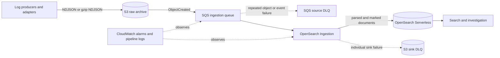

# AWS Log Platform (2026)

AWS Log Platform keeps raw logs in Amazon S3, sends S3 object notifications through Amazon SQS and its source dead-letter queue (DLQ), processes records with Amazon OpenSearch Ingestion (OSIS), and writes a bounded search projection to Amazon OpenSearch Serverless (AOSS). S3 is the canonical archive; OpenSearch is rebuildable. This repository describes and configures that architecture, but does not deploy it by itself, and `terraform apply` remains forbidden unless a later request explicitly authorizes deployment.

## Why

Durable evidence and search availability are separate concerns. Losing or being unable to recover a canonical S3 object is a raw-loss incident. Losing an index, delaying ingestion, or making AOSS unavailable is a search incident; rebuild the projection from retained S3 objects.

Managed ingestion narrows the runtime responsibilities owned by the platform team. AWS operates the OSIS service runtime. Platform owners still own the producer contract, schema and index template, S3 and search retention, access policies, monitoring, replay, capacity and cost settings, and failure handling.

## Architecture



The implemented boundary starts when an object exists under the configured S3 raw prefix. Fluent Bit, OpenTelemetry Collector, CloudWatch Logs, and Amazon Data Firehose are representative producer adapters, but none is provisioned here. Producers must preserve the S3 object and event schema contracts.

The two DLQs have different scopes:

- The SQS source DLQ contains S3 object-event messages that repeatedly failed source processing. One message can represent an entire object that is not yet searchable.
- The S3 sink DLQ contains individual documents that OSIS could not write to AOSS after sink handling. Failure to write those records to the S3 sink DLQ is a high-severity ingestion incident, although the original raw object remains canonical in S3.

The source does not rely only on a fixed SQS visibility timeout. While long-running object processing remains in flight, visibility duplication protection extends visibility up to the configured limit to reduce duplicate consumers; the standard queue remains at-least-once.

## Event contract

Each NDJSON line must be a JSON object with `timestamp` in ISO-8601 form with milliseconds and a timezone, for example `2026-09-03T10:15:30.123Z`. `timestamp` and the derived `@timestamp` both mean event occurrence time. `ingested_at` means the time the source received the event for processing; it must not replace occurrence time.

On a successful JSON parse, the indexed `message` is the application's message from the JSON object. On malformed JSON, processing continues, `message` retains the raw line, and `log_platform.parse_status` marks the document as `malformed_json`. Successfully parsed events do not receive that failure marker. A malformed event does not receive a fabricated occurrence timestamp.

The core index template uses `dynamic: false` and explicitly maps the supported root fields and the `http`, `error`, and `log_platform` objects. Unknown fields remain available in `_source`, but are not searchable until schema review adds an explicit mapping. See [architecture.md](docs/architecture.md) for the field list.

## Data lifecycle and capacity

S3 objects remain canonical and are never deleted by the ingestion pipeline. Configurable lifecycle settings move current and noncurrent objects from S3 Standard to Standard-IA and then Deep Archive. Expiration is disabled by default and can only be enabled deliberately.

`search_retention_days` controls the AOSS time-series data lifecycle period for the rebuildable search projection. It does not select or control hot/warm placement.

The OSIS persistent buffer is not adopted in this design because S3 plus SQS form the explicit durability boundary. This does not reject persistent buffering as a capability: enabling it later requires an explicit OCU allocation, KMS ownership and permissions, and cost design, and it would not replace the canonical archive or replay queue.

Production uses a minimum of 2 ingestion OCUs, which distributes active ingestion OCUs across 2 Availability Zones. Development uses a minimum of 1 OCU to reduce cost and accepts the corresponding availability tradeoff. Minimum and maximum OCU settings must be tuned against measured throughput, cost, and the search-freshness SLO.

## Failure model

The A–H failure model separates canonical raw loss from search unavailability and distinguishes source-message failures from individual sink-document failures. See [operations.md](docs/operations.md) for the complete runbooks.

## Terraform structure

`infra/modules` contains modules aligned to lifecycle, ownership, reuse, and security boundaries. `infra/live/dev` and `infra/live/prod` are independent root configurations with independent S3 backend keys. The small amount of root wiring is intentionally repeated so production state does not share a root or workspace blast radius with development.

Terraform workspaces remain useful for light variations of the same environment. They are not the primary isolation boundary here: environments with materially different accounts, permissions, lifecycle, or blast radius get separate root configurations and state objects.

Remote state uses a partial `backend "s3" {}` configuration. Each `backend.hcl.example` enables encryption and native S3 lockfiles with `use_lockfile = true`; deprecated DynamoDB-based locking is not copied forward. Backend buckets are intentionally not created or named by this repository.

## Security

- S3 blocks public access, enforces bucket-owner object ownership, enables versioning and default encryption, and denies insecure transport.
- SQS and its source DLQ use SQS-managed encryption and exact queue/bucket conditions for S3 event delivery.
- AOSS uses mandatory encryption, a private AOSS-managed VPC endpoint, an explicit network policy, and separate writer and reader data rules.
- The ingestion role can read only the configured archive prefix and consume only the configured queue. Sink-DLQ writes must be limited to the designated S3 bucket and prefix.
- `reader_principals` accepts collection-account IAM role/user ARNs and AOSS SAML user/group identity strings. Cross-account users must assume a role in the collection account. The SAML provider remains owned by the external identity platform.
- The ingestion data policy grants collection-level create, update, and describe permissions needed for templates, but no collection-item delete permission. Index and document delete permissions are also excluded.
- No credentials or secrets appear in Terraform. Account IDs, principal identifiers, VPC IDs, and subnet IDs are deployment inputs, not secrets.

See [security.md](docs/security.md) for IAM and data-access details.

## How to verify

Prerequisite: Terraform 1.10 or later. Run:

```bash
make verify
```

The script runs `terraform fmt -recursive -check`, then copies Terraform sources to a temporary directory and runs `terraform init -backend=false` and `terraform validate` for every module and live root. It also runs every module's `tests/*.tftest.hcl` with mocked providers and creates no AWS resources. It does not run a standalone `plan`, `apply`, or AWS API operation. If `tflint` is available, the script reports it but does not run it because no repository-specific plugin policy is defined.

Local validation proves syntax, provider schema compatibility, and module wiring only. It does not prove regional service availability, IAM effectiveness, service quotas, OSIS pipeline acceptance, data throughput, availability behavior, or runtime recovery.

## What is intentionally not implemented

This repository does not implement an AWS deployment, an application, producer adapters, a dashboard frontend, an authentication UI, a SAML provider, multi-Region operation, cross-account central logging, a SIEM, Amazon Security Lake, a full OpenTelemetry traces/metrics platform, incident automation, Kubernetes, or Slack integration.

## Start here

1. Read [architecture.md](docs/architecture.md) and [security.md](docs/security.md).
2. Copy the examples in one `infra/live/<environment>` directory without putting credentials in them.
3. Run `make verify`.
4. Treat any future plan or deployment as a separate, explicitly authorized task with an AWS account review, quota check, cost review, and runtime test plan.

## Authoritative references

- [AWS: S3 as an OpenSearch Ingestion source](https://docs.aws.amazon.com/opensearch-service/latest/developerguide/configure-client-s3.html)
- [AWS: OpenSearch Ingestion pipeline features and S3 sink DLQs](https://docs.aws.amazon.com/opensearch-service/latest/developerguide/osis-features-overview.html)
- [AWS: scaling OpenSearch Ingestion pipelines](https://docs.aws.amazon.com/opensearch-service/latest/developerguide/ingestion-scaling.html)
- [AWS: OpenSearch Serverless data access](https://docs.aws.amazon.com/opensearch-service/latest/developerguide/serverless-data-access.html)
- [AWS: SAML authentication for OpenSearch Serverless](https://docs.aws.amazon.com/opensearch-service/latest/developerguide/serverless-saml.html)
- [AWS: OpenSearch Ingestion metrics](https://docs.aws.amazon.com/opensearch-service/latest/developerguide/monitoring-pipeline-metrics.html)
- [HashiCorp: S3 backend and native lockfiles](https://developer.hashicorp.com/terraform/language/backend/s3)
