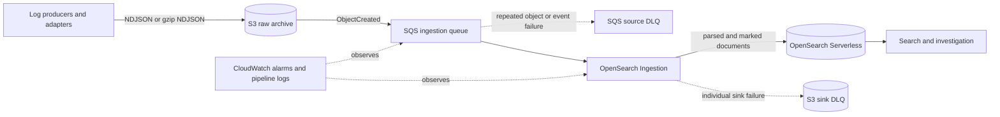

# AWS Log Platform — 日本語ケーススタディ

## 何を作ったか

Amazon S3を正本とするログ基盤のTerraform実装です。ログオブジェクトをS3へ先に保存し、S3イベントをSQSで受け、Amazon OpenSearch Ingestion（OSIS）でNDJSONを解析・補正し、Amazon OpenSearch Serverless（AOSS）へ再構築可能な検索投影を書き込みます。

このRepositoryでは、AWS環境を常時稼働させたり自動デプロイしたりするのではなく、次の境界をコード・テスト・運用文書で固定しています。

- S3のraw archiveを失わないこと。
- オブジェクト単位の再試行と、個別ドキュメントのsink失敗を分離すること。
- TerraformがAOSSの`logs` indexとschemaを所有すること。
- devとprodのroot・state・権限・blast radiusを分離すること。
- private-onlyを定常状態とし、実機で判明したindex lifecycle制約を手順化すること。

## 背景となった2022年のログ基盤経験

2022年の構成では、Fluentd、複数のAmazon Data Firehose delivery stream、transportやnotificationの補助を担うLambda、OpenSearch、選択的なS3出力、CloudWatchからSlackへの通知を組み合わせていました。複数のサービスを実際につなぐことで、batching、retry、データ形式、権限、運用時の失敗を具体的に扱えたことが出発点です。

現在の設計は、その経験をサービス数の削減だけで置き換えたものではありません。どこにデータが残るか、どの単位で失敗するか、誰がschemaを変更できるか、環境をどの境界で分けるかを、個別にレビューできる形へ整理しました。比較の詳細は[2022年からの移行記録](migration-from-2022.md)にまとめています。

## 当時の課題

以前の構成から、次の設計課題が見えました。

- 検索系が停止した時に、raw dataの損失と検索停止を同じ問題として扱いやすい。
- retry、backpressure、通知、indexingの失敗単位が、agent・stream・function・search tierに分散する。
- event occurrence timeとprocessing timeが混同されると、検索期間やfreshnessの判断を誤る。
- dynamic mappingを許すと、producerの変更がレビューなしに検索schemaへ入り得る。
- Terraform Workspaceだけでは、環境ごとのstate、権限、保持期間、障害範囲を十分に分離できない。
- managed serviceを使っても、IAM、retention、replay、capacity、cost、failure handlingの責任は残る。

## 現在の設計判断

| 論点 | 現在の判断 | 確認場所 |
| --- | --- | --- |
| 正本 | S3 raw archiveをcanonical source of truthとし、AOSSは再構築可能なprojectionにする | [Architecture](architecture.md) |
| バッファ | S3 ObjectCreatedをSQSで受け、source DLQをobject/event failure用に分ける | [Operations](operations.md) |
| managed ingestion | OSISにpolling、visibility extension、decompression、processor、sink retryを任せる | [Architecture](architecture.md) |
| schema owner | Terraform-managed AOSS `logs` indexを先に作り、OSISは`management_disabled`で書き込む | [Security](security.md) |
| schema strictness | rootを`dynamic: false`とし、numeric fieldは`coerce=false`で暗黙変換を許さない | [Runtime validation](runtime-validation.md) |
| failure boundary | object/eventはSQS source DLQ、個別のsink rejectionはS3 sink DLQへ保存する | [Architecture](architecture.md) |
| network | AOSSはprivate-onlyを定常状態とし、index lifecycle時だけ限定的な例外を使う | [Operations](operations.md) |
| environment | `infra/live/dev`と`infra/live/prod`を別root・別state keyとして管理する | [Environment state ADR](adr/0003-environment-state-boundaries.md) |

## Architecture

入力の境界は、producerがS3 raw prefixへ完全なNDJSONまたはgzip NDJSON objectを書き終えた時点です。producer adapter自体はこのRepositoryのTerraform scope外です。

## S3を正本にした理由

検索indexは、検索のためのprojectionです。indexの削除、遅延、利用不能が発生しても、S3 objectが残っていれば、対象期間やobject keyを限定して再投入できます。逆に、S3のcanonical objectと保持versionを失うと、AOSSのdocumentやsink DLQだけでは元のraw evidenceを復元できません。

そのため、ingestion pipelineはS3 objectを削除しません。S3にはversioning、暗号化、public access blocking、lifecycle制御を持たせ、検索の保持期間とraw archiveの保持期間を別の判断として扱います。

## SQS / OSIS / AOSSの責務

| Component | 所有する責務 | 所有しない責務 |
| --- | --- | --- |
| S3 raw archive | canonical object、version、暗号化、lifecycle | parsing、indexing |
| SQS / source DLQ | object/eventのbuffer、visibility、retry、redrive | individual documentのsink failure |
| OSIS | SQS polling、visibility extension、decompression、JSON処理、sink retry、sink DLQ delivery | canonical retention、AOSS schema lifecycle |
| Terraform-managed AOSS index | `logs` index、mapping、search retention | canonical logの唯一の保存 |
| AOSS | privateな検索projection、query path | raw archive、producer contract |
| CloudWatch | pipeline logと定義済みmetricに基づくalarm | notification integrationの実装全体 |

eventの`timestamp`と`@timestamp`は発生時刻、`ingested_at`はsourceが受け取った時刻です。Malformed JSONはpipelineを止めず、元の行を`message`へ残し、`log_platform.parse_status = malformed_json`として扱います。

## Failure boundary

失敗単位を分けることで、1つの不正documentがobject全体の再処理を引き起こすことを避けます。

| Failure | 保持先 | Recovery source | 実AWSでの確認 |
| --- | --- | --- | --- |
| S3 eventまたはobject処理が繰り返し失敗 | SQS source DLQ | canonical S3 object | source DLQは空のまま |
| AOSS sinkが個別documentを拒否 | S3 sink DLQ | sink recordとcanonical S3 object | numeric mapping rejectionを保存 |
| sink DLQへの保存自体が失敗 | 高severityのingestion incident | canonical S3 objectとpipeline evidence | production pagingは未検証 |
| index削除・検索投影の破損 | S3から再構築 | object keyと対象期間 | destroy後の再構築手順を定義 |

SQSのsource DLQとS3のsink DLQは、名前が似ていても目的が異なります。前者はobject/event、後者はindividual documentです。

## Security / IAM

ネットワークと認可を分けて考えています。検索・DashboardsはAOSS-managed VPC endpoint経由のprivate network policyで制限し、AOSS data access policyでTerraform index manager、OSIS writer、readerの操作を分けます。

- S3はpublic accessをblockし、bucket-owner-enforced object ownership、versioning、default encryption、TLS強制を使う。
- SQSとsource DLQは暗号化し、S3 event deliveryのsource条件をqueue policyで限定する。
- OSIS roleのS3 readはarchive prefix、queue操作は対象queue、sink DLQ writeは指定bucket/prefixへ限定する。
- Terraform index managerは`logs` indexのCreate、Update、Describe、Deleteを持つ。DeleteはTerraform destroyに必要です。
- OSISはpre-created indexへ書き込むためのdocument write等に限定し、template、read、deleteの所有者にはしない。
- IAM identity policyとAOSS data access policyの二層を維持し、AWS API上resource scopeを指定できないwildcardだけを理由付きで残す。

詳しいpolicyとwildcardの理由は[Security model](security.md)に記載しています。実際のaccount ID、principal ARN、VPC ID、subnet ID、credentialはこのケーススタディに記載していません。

## Terraform module / state boundary

`infra/modules`は、再利用性だけではなく、lifecycle ownerとsecurity boundaryで分割しています。

- `log_archive`: canonical S3 bucketとarchive controls
- `ingestion_queue`: SQS queue、source DLQ、redrive、event delivery policy
- `ingestion_identity`: OSIS role、S3、SQS、sink DLQ、private connectivity、index access
- `opensearch_serverless`: collection、private network、data access、Terraform-managed index、mapping、retention
- `opensearch_ingestion`: S3 source、parsing、visibility protection、sink DLQ、OSIS pipeline
- `observability`: pipeline logsとAWS documented metricsに基づくalarm

`infra/live/dev`と`infra/live/prod`は独立したrootです。backend keyも分け、productionのstateやblast radiusがdevelopmentの操作に巻き込まれない構造にしています。例示tfvarsは合成placeholderだけを含み、実credentialや実環境の識別子を含みません。

## 実AWS validation

2026年9月4日に、`ap-northeast-1`でdev-onlyのtemporary deploymentを実施しました。実行後にtest object、version、DLQ object、Terraform state、bootstrap resources、OSIS-managed network policyを削除し、direct residual inventoryがzeroであることを確認しました。production deploymentはありません。

実AWSで確認できた事項は次のとおりです。

- OSISが`ACTIVE`となり、S3 → SQS → OSIS → private AOSSのdata pathが通った。
- private SigV4 queryでindex結果を取得できた。
- `timestamp`が保持され、`@timestamp`へコピーされ、`ingested_at`が別に付与された。
- malformed JSONのraw lineが`message`に保持され、parse statusが付与された。
- `http.status_code`が`integer`かつ`coerce=false`、`http.duration_ms`が`long`かつ`coerce=false`であることを実際のmappingで確認した。
- numeric-looking stringを入れたdocumentが拒否され、S3 sink DLQへ保存された。AOSS検索には現れず、source queueとsource DLQは空だった。
- Terraform destroyとdirect residual inventory zeroを確認した。

詳細な結果、対象外の検証、公開時に省略した識別子は[Runtime Validation Report](runtime-validation.md)にまとめています。

## 実機で発見した問題と修正

実機検証では、想定していた設定がそのまま動くとは限らないことを確認しました。

1. OSIS processorの`add_when`を誤った階層に置くと、`CreatePipeline`が設定を拒否しました。影響する`entries`要素へ移し、regression assertionを追加しました。
2. OSIS roleのAOSS control-plane statementに付けたcollection conditionは、OSISの呼び出しでは有効なidentity allowになりませんでした。AWS APIが必要とするactionを残し、適用できなかったconditionを除去しました。data access policyのindex scopeは維持しています。
3. OSISの`management_disabled`と`template_content`だけでは、AOSSの実mappingのownerになりませんでした。schemaをTerraform-managed `awscc_opensearchserverless_collection_index`へ移し、OSISは既存indexへ書く構成にしました。
4. private-only collectionでは、AWS Cloud Controlのindex handlerがindex lifecycle中にcollectionへ到達できない制約がありました。exact collectionだけを対象とするdefault-offのtemporary network exceptionと、apply/destroyの二段階helperを追加しました。成功後のsteady stateはprivate-onlyです。

これらは、Terraformのplanやmockだけでは見つけにくい境界でした。実機の拒否内容、実際のmapping、DLQ record、cleanup inventoryを別々の証拠として扱っています。

## 未実施事項 / Fact Boundary

### 実AWSで確認済み

core data path、failure path、private query、timestamp semantics、malformed preservation、strict mapping、sink DLQ preservation、destroy、direct residual zeroです。いずれも1回のtemporary dev validationの範囲です。

### local / mockで確認済み

Terraform format、backendなしのinit・validate、module mock tests、shell syntax、lifecycle helperの入力制限と二段階phase orchestrationです。

### 未検証

- production load、throughput、index/search latency、throttling、quota
- long-duration operation、AZ障害、multi-Region、DR
- production alerting、paging、ownership、replay運用
- 実AWS cost。記録されていない金額を推測していません。

従って、この成果物はproduction availabilityの保証ではなく、設計判断とbounded runtime evidenceをレビューできるポートフォリオです。

## この成果物から示せる能力

- **システム境界の設計**: canonical storage、rebuildable projection、source/sink DLQを責務として分解できる。
- **AWS managed serviceの実機検証**: OSIS、SQS、S3、AOSS、VPC endpoint、IAMの相互作用を、実際の拒否と成功レスポンスで切り分けられる。
- **schema governance**: dynamic mappingに依存せず、Terraformの明示mappingとstrict numeric behaviorを維持できる。
- **security設計**: private network、IAM identity policy、AOSS data access policy、prefix/index scopeを分けてレビューできる。
- **Terraform運用設計**: module owner、dev/prod state boundary、lifecycle helper、mock testを一つの変更契約として整理できる。
- **障害時の説明責任**: 成功したこと、実機で発見して修正したこと、まだ検証していないことを分けて記録できる。

実装の入口は[README](../README.md)、技術詳細は[Architecture](architecture.md)、運用手順は[Operations](operations.md)、IAMは[Security](security.md)から確認できます。
